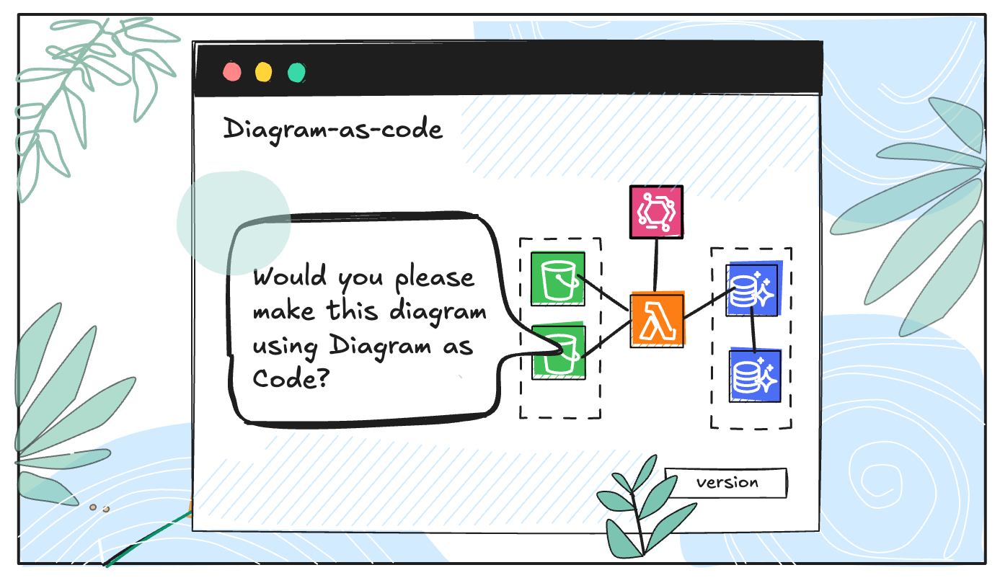
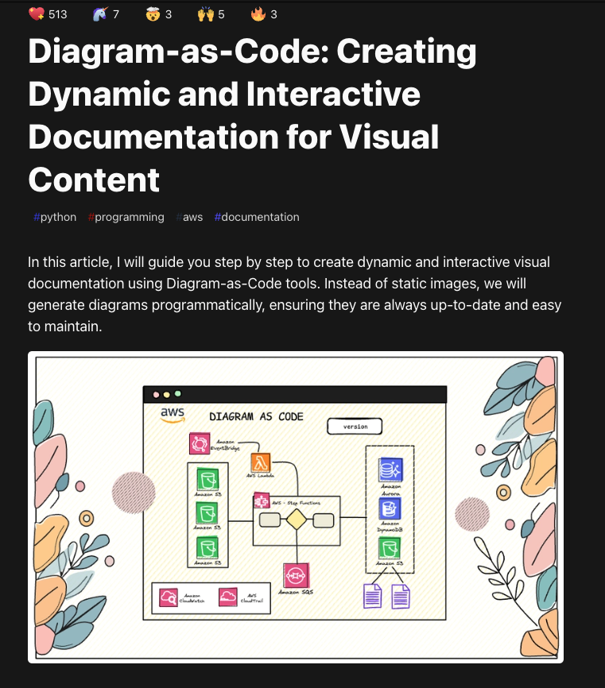

---

#  You Asked, I Coded: AWS Architecture as Diagram-as-Code

A few days ago, someone left a comment on my previous article — a post that turned out to be very popular, reaching over 50K views and earning 300 GitHub stars ⭐️.
❤️ I **want to sincerely thank** every single reader who took the time to read, leave feedback, and star the repository...
Your support truly motivates me to keep writing, sharing, and growing with the community.

---

## 🙃 A Reader’s Question That Inspired This Post  

  

    
👤 @reader

    
📅 May 2, 2025

  

  

    Hey Romina, would you please make this diagram using <strong>Diagram as Code</strong>?  
    🔗 <a href="https://github.com/aws-samples/aws-three-tier-web-architecture-workshop/blob/main/application-code/web-tier/src/assets/3TierArch.png" target="_blank">Link to the original diagram</a>
  

  

  

    👍 1  💬 1 replies  <a href="#" style="text-decoration: none; color: #555;">Reply</a>
  

---

# Haven’t read my first article?
If you’re new to Diagram-as-Code, I highly recommend starting with my introductory tutorial.

[Link to the article](https://dev.to/r0mymendez/diagram-as-code-creating-dynamic-and-interactive-documentation-for-visual-content-2p93)

---

# What is Diagram-as-Code?

Let’s go over a quick introduction to Diagram-as-Code. 

> **Diagram-as-Code** is an approach that allows you to define diagrams through code instead of drawing them manually.
This method makes it possible to version, update, and maintain visual representations just like any other software artifact.

For a more in depth explanation, feel free to check out my previous article.

---

## In this tutorial I will cover:

1. 🔧 Key Components: `Diagram`, `Cluster`, and `Node`
2. 🎨 Styling with `graph_attr`
3. ☁️ Creating an AWS Three-Tier Web Architecture

---